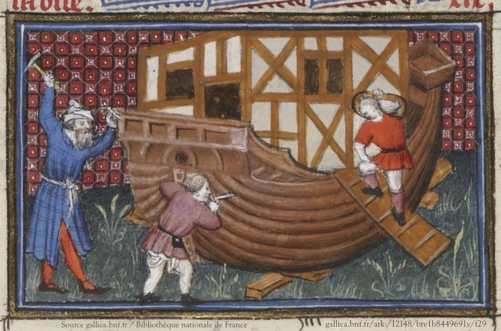

\---

confluence-id: 90977633

confluence-space: %%CONFLUENCE-SPACE%%

\---

ARKs in the Open Project
========================

Created by Erin Tripp, last modified by John Kunze on Jan 26, 2021

In 2018 the California Digital Library (CDL) and [DuraSpace](http://duraspace.org/about) (now LYRASIS) announced a collaboration aimed at building an open, international community around [Archival Resource Keys (ARKs)](http://n2t.net/e/ark_ids.html) and their use as persistent identifiers in the open scholarly ecosystem.

In January 2021, the community that matured from that collaboration was renamed the

[ARK Alliance (arks.org)](https://arks.org),

and it became the new public face of the work that continues from the ARKs-in-the-Open project. Please visit [arks.org](https://arks.org) as the first stop for information about ARKs – their users, community, software, best practices, etc. The older website (this wiki) continues to provide collaboration support for the ARK Alliance's working groups listed in the sidebar.

### Project Summary

As of January 2021 over 700 institutions (research, not-for-profit, private, government) across the world had registered to use ARKs.  They created an estimated 8.2 billion ARKs with publicly resolvable links to objects (digital, physical, people, places, etc).

Since 2001, CDL had served as the incubator for ARK infrastructure, consisting primarily of the specification, a registry of organizations using ARKs, and a global resolver service. To achieve long-term sustainability, the ARK infrastructure had to emerge from CDL and mature in partnership with multiple organizations and community participants to guide its future.

To jumpstart the process, CDL sought a collaboration with DuraSpace, an independent not-for-profit organization providing leadership for open technologies and communities such as Fedora, DSpace, and VIVO. With DuraSpace/LYRASIS’s help, the ARK outreach efforts have included:

*   Assembling and consulting with an ARK advisory group,
    
*   Developing procedures for shared maintenance of the organizational registry,
    
*   Consulting with the wider ARK community on requirements, priorities and models for shared community and infrastructure management,
    
*   Guiding the ARK specification through the IETF Informational RFC process, as well as,
    
*   Participating in an initiative to gauge the scope of ARK usage world-wide.
    

These activities were just a start, and growth continues in the ARK Alliance.

  

Attachments:
------------

 [KB screen shot.jpg](attachments/90977633/90977634.jpg) (image/jpeg)  
 [KB screan capture.jpg](attachments/90977633/90977635.jpg) (image/jpeg)  
 [building\_the\_ark.jpg](attachments/90977633/108757664.jpg) (image/jpeg)  
 [building\_the\_ark.jpg](attachments/90977633/108757354.jpg) (image/jpeg)