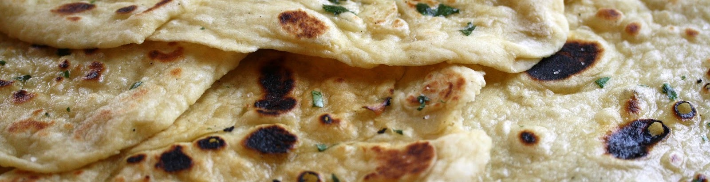

\---

confluence-id: 183075854

confluence-space: %%CONFLUENCE-SPACE%%

\---

NAAN Registry Working Group
===========================

Created by John Kunze, last modified on May 20, 2024

Purpose

The NAAN Registry Working Group (WG) oversees the registry of institutions that have been given a Name Assigning Authority Number (NAAN), with which they can begin assigning ARKs. The work consists mostly of responding to requests for new NAANs, but also to requests for changes to existing NAANs. Effectively the WG is a team of volunteer curators whose work will be ongoing. Although the WG is not expected ever to be finished, composition of the curatorial team is expected to evolve year to year.

Objectives
==========

1.  NAA maintenance. Create and refine processes that permit each [NAAN request](https://goo.gl/forms/bmckLSPpbzpZ5dix1) and Shoulder request to receive a response within 48 hours (two business days).
2.  Policy. In consultation with the Advisory Group, develop [policies](https://github.com/CDLUC3/naan_reg_priv/blob/main/Policy.md) for deciding which requests are appropriate for the ARK community. 
3.  N2T resolution support. The NAAN Registry is harvested regularly to supply vital redirection information to the N2T resolver. Work with the Technical WG to ensure stable, error-free harvesting of registry information needed for continuous and reliable resolution.

Deliverables
============

*   Create a policy document
*   Work with CDL to implement form processing changes (agreed upon in March 2022)
*   Recruit new curators
*   Convert to github projects

Resources
=========

*   A private github repository for maintaining the primary registry (private because it contains personally identifiable contact information)
*   A public repository to host the official public registry and derivative files
*   The [NAAN Request form](https://goo.gl/forms/bmckLSPpbzpZ5dix1) 
*   The [Shoulder Request (on shared NAANs) form](https://docs.google.com/forms/d/10J2VxsaeQG-IpkqZ6wpqAKqt8hYnMSf4bxdL8ktI-to)
*   The N2T resolver: [n2t.net](http://n2t.net/)
*   The [Advisory Group](https://wiki.lyrasis.org/display/ARKs/Advisory+Group) and the [Technical WG](https://wiki.lyrasis.org/display/ARKs/Technical+Working+Group)
*   [General WG features](https://wiki.duraspace.org/pages/viewpage.action?pageId=108757988) common across ARKA working groups

Curator Roles and Responsibilities
==================================

Duties
------

1.  To respond to incoming NAAN requests within 2 business days, using this curator checklist and
2.  to facilitate any NAAN working group meeting that falls in the duty period (d.

Specific Tasks
--------------

Start here at this curator checklist for responding to NAAN requests. This will require access to a private github repo that should have received an invitation to join. Note that unless you have an unexpired cookie, you may have to re-authenticate at github to avoid what looks like a 404 error (a security "feature", not a bug for private repos :).

The Duty period starts when the monthly WG meeting begins (e.g., 9AM ) and it ends when the _next_ monthly meeting begins.

During each Duty period a specific pair of curators – one primary and one secondary – is responsible for handling requests that arrive in their Duty period. Responsibilities of the primary or, if unavailable, the secondary:

1.  Handle NAAN and Shoulder requests that arrive during the Duty period
2.  Create a draft “stub” agenda for the next meeting and calendar a task to send out a reminder to the group one week in advance of that meeting. During the meeting at the start of a new Duty period is a good time for the new primary curator to create the next month’s draft meeting agenda and to calendar a reminder task one week in advance of that meeting.
3.  Facilitate the next monthly meeting (at the end of the Duty period) and be responsible for the meeting notes.
4.  At that meeting make sure the Duty Curator schedule is filled out at least two months ahead.
5.  “Pass the baton” to the new Primary and Secondary at the monthly meeting (new).

The Chair and co-chair provide continuity. Their responsibilities include

1.  Manage the googlegroup email list, lyrasis wiki accounts, and calendar invitations
2.  Be available as needed to the ARKA Advisory Group
3.  Be available, along with all WG chairs and co-chairs, to respond to code of conduct concerns.

Duty Roster
===========

The roster below indicates a primary and a backup curator on duty for a given period of time. The duties are (a) to respond to incoming NAAN requests within 2 business days and (b) to facilitate any NAAN working group meeting that falls in that time period. Here is the [curator checklist](https://github.com/CDLUC3/naan_reg_priv/blob/main/curator_check_list.md) to follow for responding to NAAN requests; note that unless you have an unexpired cookie, you may have to re-authenticate at github to avoid what looks like a 404 error (a security "feature", not a bug :) for private repos.

| When | Primary | Secondary |
| --- | --- | --- |
| **2024** |     |     |
| Aug 21 - Sep 18 | Jennifer (Aug 1-31) | John |
| Jul 17 - Aug 21 | John (Jul 17-31) | Jennifer |
| Jun 19 - Jul 17 | Bertrand | Romuald |
| May 15 - Jun 19 | Chloé | Aurélien |
| Apr 17 - May 15 | Romuald | Brian |
| Mar 20 - Apr 17 | Bertrand | Sefakor |
| Feb 21 - Mar 20 | Sefakor | Chloé |
| Jan 17 - Feb 21 | Brian | John |
| Dec 20 - Jan 17 | John | Brian |
| ^^^ **2024** ^^^ |     |     |
| Nov 15 - Dec 20 | Chloé | Aurélien |
| Oct 18 - Nov 15 | Bertrand | Maria |
| Sep 20 - Oct 18 | Romuald | Aurélien |
| Aug 16 - Sep 20 | Maria | John |
| Jul 19 - Aug 16 | John | Brian |
| Jun 21 – Jul 19 | Bertrand | Romuald |
| May 17 - Jun 21 | Chloé | Aurélien |
| Apr 19 - May 17 | Romuald | Brian |
| Mar 15 - Apr 19 | Bertrand | Maria |
| Feb 15 - Mar 15 | Aurélien | Chloé |
| Jan 18 - Feb 15 | Brian | John |
| Dec 22 - Jan 18 | John | Brian |
| ^^^ **2023** ^^^ |     |     |

[Duty roster for prior dates](https://wiki.lyrasis.org/display/ARKs/Old+curator+duty+roster).

Working Group Members
=====================

*   aurélien conraux French Ministry of Culture (vice-chair)
*   Bertrand Caron BnF (National Library of France)
*   Chloé Pochon French National Institute of Art History
*   Brian McBride University of Utah (chair)
*   Jennifer Marill, US National Library of Medicine (retired)
*   John Kunze Ronin Institute
*   Romuald Verrier French Ministry of Education
*   Sefakor Ankora WACREN

Meeting Times
=============

Teleconferences are 9am San Francisco time on the third Wednesday of each month. Connection details included in calendar invitations.

Communication Channels
======================

Because this group handles personally identifiable information (PII), while anyone can send email to [NAAN-Registrar@googlegroups.com](mailto:NAAN-Registrar@googlegroups.com), the discussion archives at [https://groups.google.com/forum/#!forum/naan-registrar](https://groups.google.com/forum/#!forum/naan-registrar) are **closed** except to group members.

Agendas and Notes
=================

[Generate new Agenda/Notes link](https://wiki.lyrasis.org?createDialogSpaceKey=ARKs&createDialogBlueprintId=44280a52-b7ed-4e6d-89fc-5e290d7766c7&title=2023-MM-DD+NAAN+Registry+WG+Agenda+and+Notes)

*   [Old curator duty roster](Old-curator-duty-roster_287637615.html)
*   [2024-06-19 NAAN Registry WG Agenda and Notes](2024-06-19-NAAN-Registry-WG-Agenda-and-Notes_343769151.html)
*   [2024-05-15 NAAN Registry WG Agenda and Notes](2024-05-15-NAAN-Registry-WG-Agenda-and-Notes_336199682.html)
*   [2024-04-17 NAAN Registry WG Agenda and Notes](2024-04-17-NAAN-Registry-WG-Agenda-and-Notes_326697363.html)
*   [2024-03-20 NAAN Registry WG Agenda and Notes](2024-03-20-NAAN-Registry-WG-Agenda-and-Notes_326697126.html)
*   [2024-02-21 NAAN Registry WG Agenda and Notes](2024-02-21-NAAN-Registry-WG-Agenda-and-Notes_321585217.html)
*   [2024-01-17 NAAN Registry WG Agenda and Notes](2024-01-17-NAAN-Registry-WG-Agenda-and-Notes_318046363.html)
*   [2023-12-20 NAAN Registry WG Agenda and Notes](2023-12-20-NAAN-Registry-WG-Agenda-and-Notes_317096024.html)
*   [2023-11-15 NAAN Registry WG Agenda and Notes](2023-11-15-NAAN-Registry-WG-Agenda-and-Notes_309362695.html)
*   [2023-10-18 NAAN Registry WG Agenda and Notes](2023-10-18-NAAN-Registry-WG-Agenda-and-Notes_307003499.html)
*   [2023-09-20 NAAN Registry WG Agenda and Notes](2023-09-20-NAAN-Registry-WG-Agenda-and-Notes_298811769.html)
*   [2023-08-16 NAAN Registry WG Agenda and Notes](2023-08-16-NAAN-Registry-WG-Agenda-and-Notes_298811648.html)
*   [2023-07-19 NAAN Registry WG Agenda and Notes](2023-07-19-NAAN-Registry-WG-Agenda-and-Notes_294453471.html)
*   [2023-06-21 NAAN Registry WG Agenda and Notes](2023-06-21-NAAN-Registry-WG-Agenda-and-Notes_291799450.html)
*   [2023-05-17 NAAN Registry WG Agenda and Notes](2023-05-17-NAAN-Registry-WG-Agenda-and-Notes_289079648.html)
*   [2023-04-19 NAAN Registry WG Agenda and Notes](2023-04-19-NAAN-Registry-WG-Agenda-and-Notes_287637547.html)
*   [2023-03-15 NAAN Registry WG Agenda and Notes](2023-03-15-NAAN-Registry-WG-Agenda-and-Notes_282755222.html)
*   [2023-02-15 NAAN Registry WG Agenda and Notes](2023-02-15-NAAN-Registry-WG-Agenda-and-Notes_273351953.html)
*   [2023-01-18 NAAN Registry WG Agenda and Notes](2023-01-18-NAAN-Registry-WG-Agenda-and-Notes_273350694.html)
*   [2022-11-16 NAAN Registry WG Agenda and Notes](2022-11-16-NAAN-Registry-WG-Agenda-and-Notes_266600567.html)
*   [2022-10-19 NAAN Registry WG Agenda and Notes](2022-10-19-NAAN-Registry-WG-Agenda-and-Notes_262078629.html)
*   [2022-09-21 NAAN Registry WG Agenda and Notes](2022-09-21-NAAN-Registry-WG-Agenda-and-Notes_257720333.html)
*   [2022-08-17 NAAN Registry WG Agenda and Notes](2022-08-17-NAAN-Registry-WG-Agenda-and-Notes_249135989.html)
*   [2022-07-20 NAAN Registry WG Agenda and Notes](2022-07-20-NAAN-Registry-WG-Agenda-and-Notes_249135363.html)
*   [2022-06-15 NAAN Registry WG Agenda and Notes](2022-06-15-NAAN-Registry-WG-Agenda-and-Notes_246284403.html)
*   [2022-05-18 NAAN Registry WG Agenda and Notes](2022-05-18-NAAN-Registry-WG-Agenda-and-Notes_230828034.html)
*   [2022-04-20 NAAN Registry WG Agenda and Notes](2022-04-20-NAAN-Registry-WG-Agenda-and-Notes_230824783.html)
*   [2022-03-16 NAAN Registry WG Agenda and Notes](2022-03-16-NAAN-Registry-WG-Agenda-and-Notes_230822807.html)
*   [2022-02-16 NAAN Registry WG Agenda and Notes](2022-02-16-NAAN-Registry-WG-Agenda-and-Notes_230820624.html)
*   [2022-01-19 NAAN Registry WG Agenda and Notes](2022-01-19-NAAN-Registry-WG-Agenda-and-Notes_230818949.html)
*   [2020-2021 NAAN Meetings](2020-2021-NAAN-Meetings_273351384.html)

  

  

  

  

  

  

  

  

Attachments:
------------

 [NAAN\_slice.jpg](attachments/183075854/184975812.jpg) (image/jpeg)