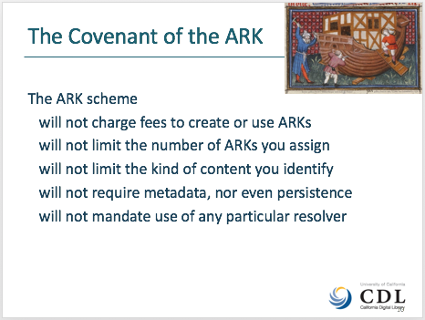

\---

confluence-id: 96993669

confluence-space: %%CONFLUENCE-SPACE%%

\---

Project Vision
==============

Created by Erin Tripp, last modified by John Kunze on Feb 01, 2019

Our long term vision for ARK identifiers: 

*   We provide high-quality, affordable identifiers, supporting today’s and tomorrow’s scholarship
    
*   We collaborate with libraries, archives, museums, publishers, research institutes, data centers, and educational institutions.
    
*   We work openly to help the world to know itself through time by providing long-term access to global cultural and scientific heritage.
    

Let us know what you think by commenting on this wiki page or via the ARK mailing list. 

Attachments:
------------

 [image2019-2-1\_12-12-25.png](attachments/96993669/108760887.png) (image/png)