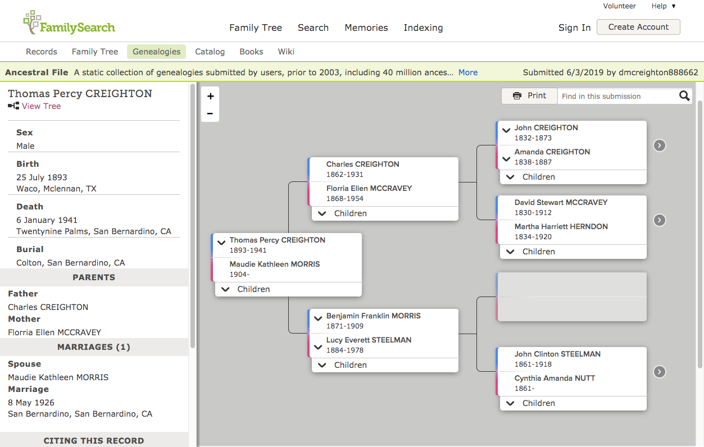
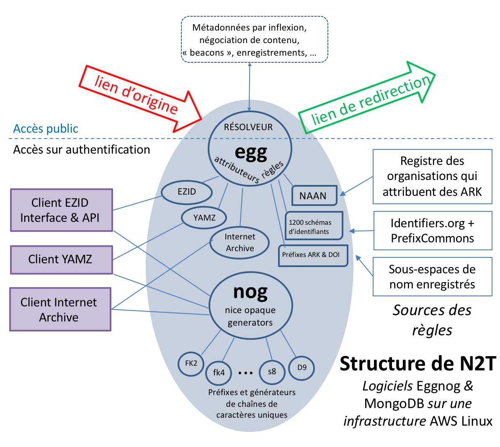

\---

confluence-id: 178880619

confluence-space: %%CONFLUENCE-SPACE%%

\---

🇫🇷 FAQ sur les identifiants ARK
=================================

Created by John Kunze, last modified on Apr 28, 2020

**Foire aux questions-réponses sur les ARK**

Ceci est la traduction française du document "ARK Identifiers FAQ".

/\*<!\[CDATA\[\*/ div.rbtoc1719792980597 {padding: 0px;} div.rbtoc1719792980597 ul {margin-left: 0px;} div.rbtoc1719792980597 li {margin-left: 0px;padding-left: 0px;} /\*\]\]>\*/

*   [Les bases](#id-🇫🇷FAQsurlesidentifiantsARK-Lesbases)
    *   [Comment puis-je donner mon avis sur ce document ?](#id-🇫🇷FAQsurlesidentifiantsARK-Commentpuis-jedonnermonavissurcedocument?)
    *   [Que sont les ARK ?](#id-🇫🇷FAQsurlesidentifiantsARK-QuesontlesARK?)
    *   [Qu'est-ce qu'un identifiant ?](#id-🇫🇷FAQsurlesidentifiantsARK-Qu'est-cequ'unidentifiant?)
    *   [Qu'est-ce qu'un « identifiant pérenne » ?](#id-🇫🇷FAQsurlesidentifiantsARK-Qu'est-cequ'un«identifiantpérenne»?)
    *   [Qu'est-ce qu'un résolveur ?](#id-🇫🇷FAQsurlesidentifiantsARK-Qu'est-cequ'unrésolveur?)
    *   [À quoi peut-on attribuer un ARK ?](#id-🇫🇷FAQsurlesidentifiantsARK-Àquoipeut-onattribuerunARK?)
    *   [Qui utilise les ARK ?](#id-🇫🇷FAQsurlesidentifiantsARK-QuiutiliselesARK?)
*   [Pour commencer](#id-🇫🇷FAQsurlesidentifiantsARK-Pourcommencer)
    *   [De quoi ai-je besoin pour créer des ARK ?](#id-🇫🇷FAQsurlesidentifiantsARK-localglobalDequoiai-jebesoinpourcréerdesARK?)
    *   [Comment commencer à créer des chaînes de caractères destinées à devenir des ARK ?](#id-🇫🇷FAQsurlesidentifiantsARK-CommentcommenceràcréerdeschaînesdecaractèresdestinéesàdevenirdesARK?)
    *   [Que sont les identifiants opaques ?](#id-🇫🇷FAQsurlesidentifiantsARK-Quesontlesidentifiantsopaques?)
    *   [Comment rendre le contenu du serveur accessible via les ARK ?](#id-🇫🇷FAQsurlesidentifiantsARK-CommentrendrelecontenuduserveuraccessiblevialesARK?)
    *   [Comment citer ou faire connaître un ARK ?](#id-🇫🇷FAQsurlesidentifiantsARK-CommentciteroufaireconnaîtreunARK?)
    *   [Existe-t-il des outils et des services de gestion d’ARK ?](#id-🇫🇷FAQsurlesidentifiantsARK-outilsExiste-t-ildesoutilsetdesservicesdegestiond’ARK?)
*   [Pour aller plus loin](#id-🇫🇷FAQsurlesidentifiantsARK-Pourallerplusloin)
    *   [Qu'est-ce que N2T ?](#id-🇫🇷FAQsurlesidentifiantsARK-Qu'est-cequeN2T?)
    *   [Si la plupart des ARK ont leur propre résolveur, pourquoi existe-t-il également un résolveur global pour les ARK ?](#id-🇫🇷FAQsurlesidentifiantsARK-SilaplupartdesARKontleurproprerésolveur,pourquoiexiste-t-ilégalementunrésolveurglobalpourlesARK?)
    *   [Mon organisation a son propre résolveur ARK - dois-je me soucier de N2T.net ?](#id-🇫🇷FAQsurlesidentifiantsARK-monResolveurVsN2TMonorganisationasonproprerésolveurARK-dois-jemesoucierdeN2T.net?)
    *   [Pourquoi le résolveur ARK global (n2t.net) ne contient-il pas le mot « ARK » ?](#id-🇫🇷FAQsurlesidentifiantsARK-PourquoilerésolveurARKglobal(n2t.net)necontient-ilpaslemot«ARK»?)
    *   [Que désigne-t-on par « transfert de suffixe » ?](#id-🇫🇷FAQsurlesidentifiantsARK-transfertDeSuffixeQuedésigne-t-onpar«transfertdesuffixe»?)
    *   [Quelles sont les parties d'un ARK ?](#id-🇫🇷FAQsurlesidentifiantsARK-Quellessontlespartiesd'unARK?)
    *   [Puis-je attribuer des ARK à des composantes d’une ressource qui a déjà un ARK ?](#id-🇫🇷FAQsurlesidentifiantsARK-granularitePuis-jeattribuerdesARKàdescomposantesd’uneressourcequiadéjàunARK?)
    *   [Quel est le but du NAAN et puis-je y apporter des modifications ?](#id-🇫🇷FAQsurlesidentifiantsARK-QuelestlebutduNAANetpuis-jeyapporterdesmodifications?)
    *   [Y a-t-il des restrictions d’usage des NAAN ?](#id-🇫🇷FAQsurlesidentifiantsARK-Ya-t-ildesrestrictionsd’usagedesNAAN?)
*   [ARK et les autres identifiants](#id-🇫🇷FAQsurlesidentifiantsARK-ARKetlesautresidentifiants)
    *   [Pourquoi utiliser des ARK plutôt que des DOI, par exemple ?](#id-🇫🇷FAQsurlesidentifiantsARK-PourquoiutiliserdesARKplutôtquedesDOI,parexemple?)
    *   [Qu'ont en commun ARK, DOI, Handle, PURL et URN ?](#id-🇫🇷FAQsurlesidentifiantsARK-Qu'ontencommunARK,DOI,Handle,PURLetURN?)
    *   [Attendez, vous voulez dire que ARK, DOI, Handle, PURL et URN sont inutiles ?](#id-🇫🇷FAQsurlesidentifiantsARK-Attendez,vousvoulezdirequeARK,DOI,Handle,PURLetURNsontinutiles?)
    *   [En quoi les ARK diffèrent-ils des identifiants tels que les DOI, les Handle, les PURL et les URN ?](#id-🇫🇷FAQsurlesidentifiantsARK-differenceSchemasIdentifiantsEnquoilesARKdiffèrent-ilsdesidentifiantstelsquelesDOI,lesHandle,lesPURLetlesURN?)
        *   [La réponse courte](#id-🇫🇷FAQsurlesidentifiantsARK-Laréponsecourte)
        *   [D’autres différences entre ARK, DOI, Handle, PURL et URN](#id-🇫🇷FAQsurlesidentifiantsARK-D’autresdifférencesentreARK,DOI,Handle,PURLetURN)
    *   [Mais si les ARK peuvent être supprimés, comment peut-on leur faire confiance ?](#id-🇫🇷FAQsurlesidentifiantsARK-MaissilesARKpeuventêtresupprimés,commentpeut-onleurfaireconfiance?)
    *   [Un objet peut-il avoir à la fois un ARK et un DOI ?](#id-🇫🇷FAQsurlesidentifiantsARK-Unobjetpeut-ilavoiràlafoisunARKetunDOI?)
    *   [Quand dois-je utiliser ARK plutôt que DOI, Handle, PURL ou URN ?](#id-🇫🇷FAQsurlesidentifiantsARK-Quanddois-jeutiliserARKplutôtqueDOI,Handle,PURLouURN?)
*   [Du berceau au tombeau](#id-🇫🇷FAQsurlesidentifiantsARK-Duberceauautombeau)
    *   [Quand dois-je créer des ARK dans mon processus de travail ?](#id-🇫🇷FAQsurlesidentifiantsARK-Quanddois-jecréerdesARKdansmonprocessusdetravail?)
    *   [Comment se fait-il que les ARK puissent être faciles à supprimer ?](#id-🇫🇷FAQsurlesidentifiantsARK-Commentsefait-ilquelesARKpuissentêtrefacilesàsupprimer?)
    *   [Pourquoi dit-on que les ARK sont adaptés à des objets dans un stade précoce de développement ?](#id-🇫🇷FAQsurlesidentifiantsARK-precocePourquoidit-onquelesARKsontadaptésàdesobjetsdansunstadeprécocededéveloppement?)
    *   [Si les ARK ne les exigent pas, pourquoi se donner la peine de créer des métadonnées ?](#id-🇫🇷FAQsurlesidentifiantsARK-metadonneesSilesARKnelesexigentpas,pourquoisedonnerlapeinedecréerdesmétadonnées?)
    *   [Quelles métadonnées sont recommandées pour les ARK ?](#id-🇫🇷FAQsurlesidentifiantsARK-QuellesmétadonnéessontrecommandéespourlesARK?)
    *   [Pourquoi est-ce que je vois des métadonnées ARK avec les termes « qui », « quoi », « quand », « où » ?](#id-🇫🇷FAQsurlesidentifiantsARK-Pourquoiest-cequejevoisdesmétadonnéesARKaveclestermes«qui»,«quoi»,«quand»,«où»?)
    *   [Qu'est-ce qu'une « inflexion » et en quoi diffère-t-elle de la « négociation de contenu » ?](#id-🇫🇷FAQsurlesidentifiantsARK-inflexionQu'est-cequ'une«inflexion»etenquoidiffère-t-elledela«négociationdecontenu»?)
    *   [Qu'entendez-vous par « silos » ?](#id-🇫🇷FAQsurlesidentifiantsARK-Qu'entendez-vouspar«silos»?)

Les bases
=========

Comment puis-je donner mon avis sur ce document ?
-------------------------------------------------

En commentant cette version ouverte aux commentaires.

Que sont les ARK ?
------------------

Les ARK (_Archival Resource Key_) sont des **identifiants** de haute performance qui vous donnent accès à des choses et à des descriptions de ces choses. Par exemple, cet ARK,

     [https://n2t.net/ark:/67531/metadc107835/](https://n2t.net/ark:/67531/metadc107835/)

vous donne accès à une thèse, et, en ajoutant '??' à la fin de l'ARK, devrait vous amener à sa description :

     [https://n2t.net/ark:/67531/metadc107835/??](https://n2t.net/ark:/67531/metadc107835/??)

Qu'est-ce qu'un identifiant ?
-----------------------------

Sur Internet, un **identifiant** est une URL, ou une partie d'URL. Par exemple, cet identifiant ARK principal,

[ark:/12148/btv1b8449691v/f29](http://ark/12148/btv1b8449691v/f29)

figure dans deux URL (_Uniform Resource Locators_, également appelés « liens Web » ou « adresses Web ») différentes :

        [http://ark.bnf.fr/ark:/12148/btv1b8449691v/f29](http://ark.bnf.fr/ark:/12148/btv1b8449691v/f29)  
        [https://n2t.net/ark:/12148/btv1b8449691v/f29](https://n2t.net/ark:/12148/btv1b8449691v/f29)

Les ARK sont plus particulièrement destinés à être des identifiants pérennes.

Qu'est-ce qu'un « identifiant pérenne » ?
-----------------------------------------

On a estimé que la durée de vie moyenne d'un URL était de 44 jours. La fin de la vie d’un URL advient lorsque celui-ci se « rompt » ; il  vous retourne alors la redoutable erreur "404 Introuvable" que la plupart d’entre nous connaissent bien. Non seulement c’est agaçant, mais c’est en outre politiquement embarrassant lorsque l’on recherche des publications scientifiques financées sur fonds publics, et c’est un désastre culturel pour les bibliothèques, les archives, les musées et autres institutions mémorielles.

Parmi les multiples liens qui peuvent ou ont pu vous conduire à une chose, un **identifiant pérenne** est un lien qui, en principe, continue de fonctionner très longtemps. Les services qui permettent la découverte et l'interconnexion de ressources (comme entre les articles universitaires, les auteurs, les données de la recherche et les sujets connexes) préfèrent les identifiants pérennes en raison de cette stabilité.

Les identifiants pérennes devraient continuer à fonctionner même lorsque les choses sont déplacées d'un site Web à un autre. Normalement, lorsque les choses sont déplacées, tous ceux qui ont déjà enregistré les anciens liens devraient être informés des nouveaux, ce qui est presque impossible. C'est alors qu'interviennent les **résolveurs** d'identifiants.

Qu'est-ce qu'un résolveur ?
---------------------------

Un résolveur est un site Web spécialisé dans la réorientation d'identifiants entrants (ceux initialement annoncés aux utilisateurs) vers les sites Web actuellement les mieux à même de les traiter. Ce transfert est généralement appelé « **résolution** » et une des étapes de ce processus de résolution la « **redirection** ».

Pour qu'un résolveur fonctionne, son nom d'hôte - _hostname_ en anglais - (« [n2t.net](http://n2t.net) » ou « [ark.bnf.fr](http://ark.bnf.fr) » dans les identifiants ci-dessus) doit être soigneusement choisi afin qu'il ne soit plus nécessaire de le changer. Les noms d’hôte des institutions mémorielles, dont certaines sont vieilles de plusieurs siècles, sont souvent de bons candidats pour devenir des résolveurs. On citera d’autres résolveurs, plus récents et plus connus : n2t.net (le résolveur ARK), identifiers.org, doi.org, handle.net et purl.org.

À quoi peut-on attribuer un ARK ?
---------------------------------

À toute chose numérique, physique ou abstraite. Cela inclut les choses qui n’existent pas encore mais auxquelles vous devez faire référence depuis des objets que vous créez ou prévoyez de créer, comme un lien depuis le brouillon d’un article vers un jeu de données en préparation, ou un lien depuis une lettre numérique archivée vers un instrument de recherche à créer. Attention, vous ne devriez attribuer des ARK qu’à des choses que vous possédez, contrôlez ou gérez. Attribuer des ARK à des choses que vous ne contrôlez pas est déconseillé car de tels identifiants sont généralement fragiles.

Vous trouverez ci-dessous une liste de choses qui reçoivent des ARK. Les nombres sont une estimation produite en septembre 2019 par les organisations elles-mêmes.

|     |     |
| --- | --- |
| Catégories | Exemples |
| *   Documents généalogiques (3 milliards, FamilySearch) *   Contenus d’éditeurs (100 millions, Portico) *   Publications scientifiques (22 millions, INIST) *   Textes numérisés (20 millions, Internet Archive) *   Notices bibliographiques (15 millions, catalogue général de la BnF) *   Objets muséaux (11 millions, bientôt 100 millions, Bibliothèques de la Smithsonian Institution) *   Documents publics de santé, la plupart issus de mesures d’établissement de preuves légales (14 millions, Bibliothèques de l’UCSF) *   Documents et objets numérisés (5 millions, Gallica, BnF) *   Auteurs et universitaires liés à des sources historiques (4 millions, SNAC) *   Instruments de recherche et collections précieuses (4 millions, Merritt) *   Cartes de ressources (1,5 millions, RMap Hub) *   Ressources pédagogiques (1,1 million, Université de l’Utah) *   Vocabulaires contrôlés (9000, Periodo, YAMZ) *   des jeux de données, des journaux, des objets archéologiques, des êtres vivants, etc. |  |

Qui utilise les ARK ?
---------------------

Difficile à dire car les ARK sont décentralisés, mais plus de 600 organisations enregistrées ont créé, selon leurs estimations, environ 3,2 milliards d’ARK. Vous trouverez des ARK utilisés comme permaliens dans

*   le Data Citation Index (lié au Web of Science)
*   les articles de Wikipédia
*   les entrées de Wikidata
*   les collections d’Internet Archive)
*   les profils de chercheurs ORCID

Voici la répartition globale des organisations enregistrées comme attributrices d’ARK en avril 2020. Cliquez sur l’image ci-dessous pour accéder à une carte à jour et zoomable.

Pour commencer
==============

 De quoi ai-je besoin pour créer des ARK ?
------------------------------------------

Tout d'abord, vous avez besoin d'un NAAN (numéro d'autorité nommante, ou _Name Assigning Authority Number_ en anglais), qui est un numéro exclusivement réservé à votre organisation. Il doit apparaître dans chaque ARK attribué par votre organisation, juste après l'étiquette "ark:/". Le NAAN de tous ces ARK

                               ark:/12148/btv1b8449691v/f29

     http://ark.bnf.fr/ark:/12148/btv1b8449691v/f29

      https://n2t.net/ark:/12148/btv1b8449691v/f29

est 12148 ; il identifie de manière unique la Bibliothèque nationale de France. Chaque NAAN est associé à l'URL d'un résolveur pour ses ARK. Par exemple, pour résoudre un ARK en 12148, apposez-le après [http://ark.bnf.fr/](http://ark.bnf.fr/) comme indiqué ci-dessus. Le résolveur N2T.net est à part dans la mesure où il transmet tout ARK au résolveur associé à son NAAN.

L'obtention ou l'utilisation d'un NAAN est gratuite et vous pouvez en demander un en remplissant un formulaire en ligne. Plus de 600 organisations (bibliothèques, archives, musées, facultés, agences gouvernementales, éditeurs scientifiques et pédagogiques, projets, etc.) ont un NAAN répertorié dans le registre public NAAN.

Comment commencer à créer des chaînes de caractères destinées à devenir des ARK ?
---------------------------------------------------------------------------------

Vous êtes libre de créer des chaînes de caractère ARK à votre guise, à condition que vous n'utilisiez que des chiffres, des lettres (ASCII, donc sans aucun signe diacritique) et les caractères suivants :

\= ~ \* + @ \_ $ . /

Les deux derniers caractères sont réservés pour le cas où vous souhaiteriez divulguer des relations entre ARK.

Une autre des caractéristiques des ARK est que les traits d'union ('-') peuvent être utilisés mais qu’ils sont **inertes en ce qui concerne l'identité**, ce qui signifie que des chaînes ne différant que par des traits d'union sont considérées comme identiques ; par exemple, ces chaînes

[ark:/12345/141e86dc-d396-4e59-bbc2-4c3bf5326152](http://ark/12345/141e86dc-d396-4e59-bbc2-4c3bf5326152)  
  
[ark:/12345/141e86dcd3964e59bbc24c3bf5326152](http://ark/12345/141e86dcd3964e59bbc24c3bf5326152)

identifient la même chose. La raison de cette fonctionnalité est que les processus de formatage de texte utilisés à travers le monde introduisent régulièrement des traits d'union supplémentaires dans les identifiants, rompant ainsi les liens avec tout serveur qui considère les traits d'union comme signifiants.

Les ARK distinguent majuscules et minuscules, ce qui permet des identifiants plus courts (52 contre 26 lettres par caractère). La « méthode ARK » consiste toutefois à n'utiliser que des minuscules, sauf si vous avez besoin d'ARK plus courts. Cette restriction facilite la prise en charge de vos ARK par les résolveurs s’ils sont reçus avec des majuscules ou des majuscules et minuscules mélangées, ce qui arrive malheureusement souvent à cause de l’idée, vieille de 50 ans, selon laquelle les identifiants sont insensibles à la casse. Vous pouvez également envisager d'utiliser le répertoire de caractères de l'outil Noid, qui crée des chaînes protégées contre une retranscription fautive à l'aide de l'algorithme de contrôle le plus puissant. Ce répertoire comprend uniquement des chiffres et des consonnes moins 'l' (lettre « L », souvent confondue avec le chiffre 1) :

0123456789bcdfghjkmnpqrstvwxz

Pour l'attribution, une stratégie courante consiste à tirer parti des identifiants hérités. Par exemple, un numéro de spécimen de papillon de musée, cd456f9\_87, pourrait être publié sous l’ARK [ark:/12345/cd456f9\_87](http://ark/12345/cd456f9_87). Certains identifiants hérités devront peut-être être modifiés compte tenu des restrictions de caractères ARK. La deuxième stratégie couramment utilisée consiste à créer des chaînes entièrement nouvelles pour vos ARK. Dans ce cas, il est important de considérer si elles doivent être totalement ou partiellement opaques, ou signifiantes.

Que sont les identifiants opaques ?
-----------------------------------

Les chaînes de caractères d'identifiants pérennes sont généralement **opaques** et révèlent délibérément peu de choses sur ce à quoi elles sont attribuées, car les identifiants non opaques ne vieillissent pas ou ne voyagent pas bien. Les noms d'organisations sont connus pour être transitoires, raison pour laquelle les NAAN sont des nombres opaques. Lorsque les dates et les titres sont corrigés, que les significations des mots évoluent (par exemple, d'anciens sigles innocents peuvent devenir offensants ou attentatoires), les chaînes de caractères censées être pérennes peuvent générer de la confusion ou poser un problème politique. La génération et l'attribution de chaînes de caractères complètement opaques comportent également des risques ; ainsi, des nombres attribués séquentiellement révèlent des informations sur leur date et les chaînes de caractères contenant des lettres peuvent générer fortuitement des mots (c'est pourquoi le répertoire de caractères recommandé ne comporte pas de voyelles).

|     |     |     |     |
| --- | --- | --- | --- |
| **Exemples de chaînes de caractères plus ou moins opaques** |     |     |     |
| Non opaque | Netscape Permanent Archive | Gay\_Divorcee\_1934\_April\_1 | Name-to-Thing Resolver |
| Partiellement opaque | X0001, x0002, ..., x9998 | GD/1934/04/01 | [n2t.net](http://n2t.net) |
| Plus opaque | 141e86dc-d396-4e59-bbc2-4c3bf5326152 | 19340401 | n2t |
| Totalement opaque | 141e86dcd3964e59bbc24c3bf5326152 | H8k74926g | 12148 |

  

Il n'est pas obligatoire que les ARK soient opaques, mais il est recommandé que le nom de base de l'objet le soit, car il constitue en général le nom du sujet principal de l’effort de pérennisation. Si des qualificatifs suivent ce nom, il est moins important qu'ils soient opaques. Pour vous aider à déterminer votre niveau d'opacité, vous pouvez évaluer la compatibilité avec les identifiants hérités et la facilité de génération et de retranscription de la chaîne de caractères (en prenant en compte la compacité, le caractère de contrôle). De nouvelles chaînes de caractères peuvent être générées avec la date et l’heure, un UUID, à l’aide d’un générateur de nombres ou du générateur Noid (Nice Opaque Identifiers).

Les chaînes de caractères opaques sont « muettes » et donc difficiles à gérer, c'est pourquoi les ARK ont été conçus pour être des identifiants « parlants ». Cela signifie que s'il existe des métadonnées sur la ressource, un ARK qui se présente sur votre serveur suivi de l'inflexion « ? » devrait pouvoir parler de lui-même.

Comment rendre le contenu du serveur accessible via les ARK ?
-------------------------------------------------------------

Tout d’abord, déterminez ce que sera l’expérience utilisateur lors de l’accès par vos ARK : une feuille de calcul, un PDF, une image, une page d’accueil affichant des métadonnées et plusieurs options ? Quel que soit votre choix, prévoyez que votre serveur retourne des métadonnées si l’ARK arrivait suivi d’une 🇫🇷 FAQ sur les identifiants ARK#inflexion « ? ».

Pour le reste, résoudre des ARK revient à répondre à des URL. Normalement, les URL entrants **appellent** (ou sont associés à) du contenu renvoyé par votre serveur Web. Si votre serveur est compatible ARK, les ARK entrants (exprimés sous forme d’URL) doivent être associés au même contenu. L’approche habituelle consiste à associer l’ARK à l’URL à l’aide d’une table de données que vous mettez à jour chaque fois que l’URL change. Dans ce cas, votre serveur agit comme un **résolveur local**. Si vous ne souhaitez pas l’implémenter vous-même, il existe des [outils et services logiciels ARK](https://wiki.lyrasis.org/pages/viewpage.action?pageId=178880635#id-🇫🇷FAQsurlesidentifiantsARK-outils) qui peuvent vous aider.

Une autre approche consiste à laisser votre serveur Web fonctionner en l’état et, au lieu de mettre à jour ses tables locales, de maintenir des tables de correspondance ARK/URL sur un résolveur distinct. Cette approche est adoptée par nombre d’éditeurs de logiciels et par les organisations maintenant leurs tables via le service EZID (qui est lié au résolveur n2t.net et met à jour les tables de résolution de ce dernier).

Comment citer ou faire connaître un ARK ?
-----------------------------------------

On préférera la forme URL (https ou http) de l’ARK. Par exemple : https://n2t.net/ark:/99166/w66d60p2. Un ARK destiné à un usage externe est généralement publié (annoncé, diffusé…) de cette manière afin de constituer un identifiant actionnable. Si un affichage visuel plus compact est nécessaire, il doit être associé à un lien hypertexte. Par exemple :

<a href="[https://n2t.net/ark:/99166/w66d60p2](https://n2t.net/ark:/99166/w66d60p2)">ark:/99166/w66d60p2</a>

Une décision importante consiste à déterminer si vos URI ARK utiliseront le nom d’hôte de votre résolveur local ou le résolveur N2T.net. Si vous privilégiez le contrôle ou la stratégie de marque, vous préférerez publier des ARK utilisant votre résolveur local. Si vous doutez de la stabilité de votre nom d’hôte local, vous préférerez publier vos ARK en utilisant le nom d’hôte n2t.net (voir ici des exemples des deux approches). Quelle que soit la manière dont vous les publiez, la résolution de vos ARK via N2T est toujours possible.

Existe-t-il des outils et des services de gestion d’ARK ?
---------------------------------------------------------

 Voici une liste partielle d’outils logiciels de gestion d’identifiants. Elle comprend notamment

*   Noid (Nice Opaque Identifiers), logiciel open source permettant de créer et de résoudre vous-même des ARK,
*   ArchiveSpace, une application open source pour gérer et fournir un accès web à des archives, des manuscrits et des objets numériques,
*   un plug-in ARK pour Omeka, qui crée et gère des ARK pour la plate-forme de publication Web open source Omeka,
*   un module ARK pour Drupal, qui permet à votre site Drupal d'agir en tant qu'autorité d’adressage (NMA).

On y mentionne également certains éditeurs de logiciels et fournisseurs de service, tels que EZID. Vous trouverez ici des informations supplémentaires sur les concepts et les bonnes pratiques.

Pour aller plus loin
====================

Qu'est-ce que N2T ?
-------------------

N2T.net est un résolveur ARK global. N2T, qui signifie « Name-to-Thing », est en fait un résolveur généricisé permettant d’associer des noms à des objets. Il sait ainsi rediriger plus de 600 autres types d'identifiants - ARK, DOI, PMID, Taxon, PDB, ISSN, etc. Si cela vous intéresse, le schéma et la suite de cette réponse donnent un peu plus de détails. 

Les requêtes entrantes sont généralement constituées de https://n2t.net/ suivies d’un identifiant (le nom). N2T cherche cet identifiant et renvoie un lien de redirection. Pour cela, il utilise deux méthodes de résolution. D’abord, N2T tente de résoudre l’identifiant selon une information associée à un identifiant stocké unitairement. À défaut, il applique des règles liées au type d’identifiant. Il existe également une API N2T qui permet, sur authentification, des opérations de masse et la génération d’identifiants. 

N2T utilise deux types de données stockées. Premièrement, il stocke des enregistrements individuels pour plus de 20 millions d'identifiants d'objet (par exemple, ARK, DOI) qu'il obtient de trois sources : EZID, Internet Archive et YAMZ.net. Lorsque de tels enregistrements incluent une URL de redirection (cible) et des métadonnées descriptives, N2T peut agir sur les inflexions, effectuer un transfert de suffixe et une « négociation de contenu ». 

Deuxièmement, N2T stocke plus de 3500 enregistrements de « règle » pour rediriger les identifiants qui n’ont pas été trouvés individuellement dans N2T, mais pour lesquels il dispose d'informations de redirection liées au type d'identifiant à résoudre. Il obtient des enregistrements de règles de plusieurs sources, notamment le registre NAAN, une base de données de préfixes ARK et DOI et un partenariat officiel sur les identifiants compacts avec identifiers.org.

Si la plupart des ARK ont leur propre résolveur, pourquoi existe-t-il également un résolveur global pour les ARK ?
------------------------------------------------------------------------------------------------------------------

 La plupart des ARK sont créés par des organisations qui les publient en utilisant leur propre résolveur. Par exemple, cet ARK a été publié en spécifiant le résolveur ark.bnf.fr :

http://ark.bnf.fr/ark:/12148/btv1b8449691v/f29

Avoir à gérer et à maintenir son propre résolveur est la contrepartie d’une autonomie complète. L'utilisation de votre propre résolveur vous permet également de mettre en avant votre « marque » via le nom d'hôte, l'inconvénient étant que les marques sont transitoires et ont tendance à fragiliser les identifiants. Les pressions politiques voire légales (par exemple, sur les marques commerciales) peuvent rendre difficile le maintien de noms d'hôtes de « marque » plus anciens, et donc des identifiants sur lesquels ils ont été construits. C'est un autre argument en faveur du résolveur ARK global. Les utilisateurs rencontrant ultérieurement un identifiant brisé et constatant que son nom d'hôte n'existe plus peuvent, si c'est un ARK, extraire son identité immuable de base (l’élément commençant par « ark: ») et la présenter au résolveur global n2t.net,

https://n2t.net/ark:/12148/btv1b8449691v/f29.

Mon organisation a son propre résolveur ARK - dois-je me soucier de N2T.net ?
-----------------------------------------------------------------------------

Oui, et ce pour deux raisons principales. Tout d'abord, si vos ARK « à l'état sauvage » apparaissent sans votre le nom d'hôte de votre résolveur (c'est-à-dire, s'ils commencent par « ark: ... », ce qui n'est pas rare), la personne qui veut les utiliser n'est pas tenue de connaître le nom d'hôte : il lui suffit d'ajouter « n2t.net » devant eux. Cela fonctionne car N2T connaît le nom d'hôte du résolveur.Deuxièmement, si certaines organisations et leurs noms d'hôtes résolveurs ont une longue durée de vie, la plupart ne durent pas. Une personne essayant d'utiliser un ARK contenant un nom d'hôte de résolveur non fonctionnel peut remplacer la partie non fonctionnelle par « n2t.net ». Si les circonstances vous obligent à changer votre résolveur, cette étape de remplacement donne aux ARK que vous avez publiés avant le changement une meilleure chance de fonctionner.Pour éviter de futurs désagréments, certaines organisations qui gèrent leurs propres résolveurs peuvent choisir d'emblée de préférer au nom de leur résolveur le nom de domaine n2t.net pour la publication de leurs ARK.

Pourquoi le résolveur ARK global (n2t.net) ne contient-il pas le mot « ARK » ?
------------------------------------------------------------------------------

Lorsque le besoin d'un résolveur ARK global est apparu, les principes de base d'ouverture et de généricité ont dissuadé les concepteurs de créer un autre silo sur le modèle de DOI / Handle / PURL. Au lieu de quoi, le résolveur ARK a été conçu pour être un résolveur générique, non lié à un format, appelé N2T (Name-to-Thing), qui résout maintenant plus de 600 types d'identifiants, y compris les ARK, les DOI, les Handle, les PURL, les URN, les ORCID, les ISSN, etc. La résolution consiste à rechercher dans une table une chaîne de caractères d'identifiant, quel que soit son type, et à la rediriger au bon endroit.

Les mêmes principes de base ont guidé la conception d'un outil antérieur appelé noid, conçu pour les ARK, mais également utilisé régulièrement par les organisations attribuant des Handle.

Que désigne-t-on par « transfert de suffixe » ?
-----------------------------------------------

En bref, le transfert de suffixe est une fonctionnalité de N2T. Supposons que vous n'ayez qu'un seul ARK enregistré, https://n2t.net/ark:/12345/6789, et qu'il redirige vers la page du serveur Web,https://a.example.org/dataset542Et supposons que ce même serveur serve également ces pages :https://a.example.org/dataset542/volume3https://a.example.org/dataset542/volume3/part2https://a.example.org/dataset542/volume3/part2.pdfCe que fait le transfert de suffixe est de laisser votre ARK enregistré agir comme si vous aviez également enregistré ces trois ARK ci-dessous, qui seraient résolus par les pages ci-dessus, respectivement:https://n2t.net/ark:/12345/6789/volume3https://n2t.net/ark:/12345/6789/volume3/part2https://n2t.net/ark:/12345/6789/volume3/part2.pdfDans ce cas, le transfert de suffixe vous évite d'avoir à conserver des enregistrements pour trois pages supplémentaires. En fait, cela fonctionne pour un nombre illimité de pages.

Quelles sont les parties d'un ARK ?
-----------------------------------

**Anatomie de l’ARK**           Identité immuable de base                                         \_\_\_\_\_\_\_\_\_\_\_\_\_\_\_\_\_\_\_\_\_\_\_\_\_\_\_\_\_\_\_\_\_\_\_\_                                        /                                                        \\Service de résolution       Nom de base de l’objet  Qualificatifs      \_\_\_\_\_\_\_\_\_\_\_\_\_\_\_\_\_\_\_\_\_\_   \_\_\_\_\_\_\_\_\_\_\_\_\_\_\_\_\_\_\_\_\_\_   \_\_\_\_\_\_\_\_\_\_\_\_\_     /                                 \\/                                  \\/                   \\     **https://example.org/ark:12345/654xz321/s3/f8.05v.tiff**                 \\\_\_\_\_\_\_\_\_\_\_\_\_\_/ \\\_\_\_/\\\_\_\_\_\_/ \\\_\_\_\_\_\_\_\_\_/\\\_\_\_\_\_\_/\\\_\_\_\_\_\_/                       |                  |          |             |              |          |                       |               Libellé   |             |               |     Variantes                       |                            |             |      Composantes                       |                            |             |  Nom de l’autorité d’adressage   |    Nom ARK attribué                       (NMA)                  |                       Numéro d’autorité nommante (NAAN)

Puis-je attribuer des ARK à des composantes d’une ressource qui a déjà un ARK ?
-------------------------------------------------------------------------------

Oui, les ARK peuvent être attribués à n'importe quel niveau de granularité, tel qu'un manuscrit, des chapitres à l'intérieur, des sections de chapitre, des sous-sections, etc. Un ARK peut également être attribué à une chose qui contient d'autres choses. Dans les ARK, le caractère '/' est réservé pour aider l’utilisateur à découvrir la relation de composition. Par exemple, le premier objet ci-dessous contient le second :

ark:/12148/btv1b8449691v

ark:/12148/btv1b8449691v/f29

C'est le qualificatif de granularité. Il n'y a qu'un seul autre qualificatif ARK, qui indique les variantes de forme d'une chose en utilisant le caractère réservé '.' devant un suffixe. Par exemple, ces ARK identifient des documents,

ark:/12148/btv1b8449691v/f29.pdf

ark:/12148/btv1b8449691v/f29.html

Comme ils ne diffèrent que par le suffixe .pdf ou .html, on peut en déduire qu'ils identifient deux formes différentes du même document.

Quel est le but du NAAN et puis-je y apporter des modifications ?
-----------------------------------------------------------------

 Les NAAN subdivisent l'ensemble des ARK potentiels (l'espace de noms ARK). Le sous-ensemble d'ARK d'un NAAN donné peut être subdivisé par des préfixes (par exemple : 12345/x2, 98765/b4), ce qui facilite la délégation de l'attribution autonome d'ARK, aux départements d'une grande organisation par exemple. La résolution ARK est partiellement basée sur les NAAN, mais étant donné qu’il arrive que les organisations soient scindées, ARK répond au problème de la scission d'espaces de noms en permettant à plusieurs organisations de prendre en charge la gestion d'un espace de noms. Si vous passez d’un prestataire à un autre, rien ne vous empêche d’emporter votre NAAN avec vous. Vous pouvez modifier un NAAN en remplissant le même formulaire en ligne utilisé pour demander un nouveau NAAN, par exemple pour

*   mettre à jour l'URL de la personne à contacter ou du résolveur de votre organisation,
*   modifier la stratégie d'attribution de nom de votre organisation (voir ici un exemple d’une telle stratégie),
*   demander un NAAN supplémentaire pour un nouvel ensemble important d’ARK ou un nouvel organe à l’intérieur de votre organisation,
*   ou enfin signaler le transfert de votre NAAN vers une autre organisation qui poursuivra votre travail et prendra en charge votre NAAN.

Y a-t-il des restrictions d’usage des NAAN ?
--------------------------------------------

Oui. Il est important de ne jamais inventer ou utiliser un NAAN qui ne serait pas présent dans le registre public. Il y a néanmoins deux NAAN spécifiques que chacun peut utiliser :

*   « 99999 » pour des besoins de test, de développement ou d’expérimentation,
*   « 12345 » pour des exemples d’ARK non fonctionnels à utiliser dans la documentation.

Pour les experts, reconnaître les ARK avec de tels NAAN et les éliminer des rapports de liens brisés est aisé. Malgré les efforts des fournisseurs, de tels ARK s’échappent fréquemment « dans la nature », ce qui peut induire en erreur utilisateurs et vérificateurs de liens.

ARK et les autres identifiants
==============================

Pourquoi utiliser des ARK plutôt que des DOI, par exemple ?
-----------------------------------------------------------

*   Pour réduire les coûts (voir cette section pour plus de précision) ;
*   Pour ne gérer que les métadonnées que vous voulez ;
*   Pour pouvoir créer des identifiants sans métadonnées ;
*   Pour pouvoir créer un identifiant avant même que votre objet n’existe ;
*   Pour avoir un identifiant dès que vous créez le premier brouillon de votre objet ;
*   Pour garder cet identifiant privé pendant que les données et les métadonnées évoluent, jusqu’à ce que vous décidiez (éventuellement des années après) de le publier ou de le supprimer ;
*   Pour conserver cet identifiant jusqu’à la publication et peut-être alors attribuer à la place un autre identifiant tel qu'un DOI ;
*   Parce que les ARK, conçus pour une utilisation générique et non spécifiquement pour le monde de l’édition, sont naturellement adaptés à l’identification d’objets physiques comme des échantillons ou des stations de recherche ;
*   Parce que les résolveurs ARK peuvent résoudre des identifiants habituellement endommagés par des processus de formatage de texte introduisant des traits d'union ;
*   Parce que la plupart des ARK portent un caractère de contrôle Noid qui peut être utilisé pour détecter toutes les erreurs de transcription courantes (et non certaines d’entre elles uniquement) ;
*   Pour pouvoir créer des identifiants plus courts, car la casse mixte permet des chaînes plus compactes (un plus grand nombre de chaînes d'une longueur donnée) ;
*   Pour pouvoir changer de prestataire et/ou d'infrastructure sans avoir à coordonner des transferts de bases de données avec une autorité centrale ;
*   Pour pouvoir résoudre le problème de la scission d'espace de noms sans perdre le contrôle de vos identifiants ;
*   Pour lier des identifiants à différentes déclarations de permanence nuancées ;
*   Pour pouvoir ajouter des requêtes (par exemple « ?lang=en ») lors de la résolution de vos identifiants ;
*   Pour utiliser une infrastructure ouverte correspondant aux valeurs de votre organisation ;
*   Pour permettre d’accéder directement aux objets auxquels vous accordez de l’importance et non à leur page d’accueil ;
*   Pour créer un seul identifiant qui peut être décliné en des millions (grâce au mécanisme de transfert de préfixe) ;
*   Pour accéder à des métadonnées adaptées et complètes via des inflexions
*   Pour s’intégrer aisément dans des API IIIF en utilisant les qualificatifs ARK.

Qu'ont en commun ARK, DOI, Handle, PURL et URN ?
------------------------------------------------

Ce sont les principaux types (ou schémas) d'identifiants pérennes. Tous existent au moins depuis 2001.Tous sont utilisés dans des contextes tels que les profils Data Citation Index℠, Wikipedia et ORCID.org. Tous donnent accès à presque tout type de contenu, qu'il soit numérique, physique, abstrait, une personne, un groupe, etc. Ils ont également une structure très similaire composée de quatre parties, comme le montrent les exemples ci-dessous : 

|     |     |
| --- | --- |
| https://n2t.net/_ark_:/99999/12345       https://_doi_.org/10.99999/12345    https://_handle_.net/10.99999/12345         https://_purl_.org/99999/12345    https:///_urn_:99999:12345 | 1.  le protocole (https://) plus un nom d'hôte, 2.  uniquement pour ARK et URN, un libellé (« ark: » ou « urn: »), 3.  l'autorité nommante (99999, 10.99999 ou 99999), qui est l'organisation ou le groupe qui a créé un identifiant particulier, 4.  et enfin, le nom, ou l'identifiant local, qu'elle a attribué (12345). |

 Aucun d’eux n’a d'effet réel sur la persistance (voir 10 mythes persistants sur les identifiants pérennes).

Attendez, vous voulez dire que ARK, DOI, Handle, PURL et URN sont inutiles ?
----------------------------------------------------------------------------

Non, ce serait une affirmation excessive. Mais remettons ces formats d’identifiant (types) en perspective :

*   Aucun ne protège contre les principales causes de rupture des liens : baisse de financement, catastrophe naturelle, bouleversement social, guerre, élimination délibérée, erreur humaine ou négligence du prestataire ;
*   Ils exigent tous de vous, le fournisseur final, de mettre à jour les tables de redirection à mesure que les URL changent ;
*   Ils identifient tous un contenu susceptible d'avoir été modifié ou supprimé à l’occasion de visites ultérieures ;
*   Tous comportent des identifiants brisés, et en grande quantité (plusieurs milliers) ;
*   Ils reposent tous sur le simple système de la redirection géré par les serveurs Web depuis 1994 et proposé gratuitement par des centaines de services de raccourcissement d'URL.

Étant donné le peu de choses que ces formats font pour vous, lorsque vous en choisissez un, vous prendrez probablement en compte des facteurs tels que le coût, le risque et l'ouverture. 

En quoi les ARK diffèrent-ils des identifiants tels que les DOI, les Handle, les PURL et les URN ?
--------------------------------------------------------------------------------------------------

### La réponse courte

Les ARK sont les seuls identifiants standards, non cloisonnés et non payants que vous pouvez enregistrer et utiliser en environ 48 heures. Les DOI, les Handle et les PURL nécessitent une résolution et d'autres services exigés par leurs systèmes centralisés respectifs (« silos »).

Cela ne veut pas dire que la permanence est gratuite. Rendre un identifiant pérenne, en tant que fournisseur, vous impose des coûts de gestion, d’hébergement, de surveillance et de redirection. Vous pouvez faire ces choses vous-même ou avec l'aide d'un prestataire. Mais avec les ARK, comme avec les URL, vos identifiants ne vous seront pas facturés individuellement et vous ne serez pas enfermés dans un silo n’acceptant qu’un type de résolution spécifique et qui refuse donc les autres identifiants.

Les ARK ont la particularité d'être décentralisés. Bien que l’on puisse obtenir des services de résolution d'un résolveur ARK global appelé n2t.net, plus de 90% des ARK dans le monde ne l’utilisent pas comme résolveur. Plus de 600 organisations enregistrées à travers le monde ont créé par elles-mêmes environ 3,2 milliards d’ARK et, à l'instar des URL, personne n'a jamais payé de frais pour les créer. Bien sûr, les maintenir n'est pas gratuit. Conserver l’accès au contenu de manière pérenne sur le long terme, quel que soit le type d’identifiant, n’est jamais gratuit.

### D’autres différences entre ARK, DOI, Handle, PURL et URN

*   ·Les pages d'accueil : les DOI de Crossref et DataCite aboutissent à des pages d'atterrissage conçues pour les éditeurs, mais pas directement aux objets qui vous tiennent à cœur. Les ARK peuvent en revanche aboutir directement aux objets qui vous tiennent à cœur, ce qui est pratique à la fois pour les machines et pour les utilisateurs, car cela ne demande pas à l’humain une étape supplémentaire de navigation pour des tâches courantes telles que
    *   ouvrir le fichier PDF d'un article en lecture,
    *   référencer un fichier image destiné à être incorporé automatiquement en ligne dans un document,
    *   ou citer un tableur à utiliser pour l’analyse directe des données par logiciel.
*   Les DOI, les Handle, etc., ne prennent pas en charge le mécanisme d’[inflexion](https://wiki.lyrasis.org/pages/viewpage.action?pageId=178880635#id-🇫🇷FAQsurlesidentifiantsARK-inflexion) d’ARK permettant l'accès aux métadonnées, qu'un identifiant pointe sur un objet ou sur sa page d’accueil.
*   Contrairement aux DOI et aux Handle, les ARK n’ont pas de métadonnées obligatoires. Les ARK qui n'ont pas encore été publiés sont faciles à supprimer.
*   Toute chose finira par disparaître, y compris les noms d’hôte, le Web et le protocole https. Lorsque cette première partie de l'identifiant cessera d'avoir une signification, seuls les ARK et les URN incluront un libellé (par exemple, « ark: ») indiquant le type d'identifiant restant.
*   Pour les DOI, les Handle et les PURL, vous devez utiliser leurs résolveurs respectifs. Les ARK et les URN vous permettent d'utiliser votre propre résolveur.
*   Pour créer des DOI et des Handle, vous devez payer une cotisation et, pour les DOI, des frais par DOI définis par les agences d’attribution. Il n'y a pas de frais pour les ARK, les PURL et les URN.
*   Pour créer des Handle, vous devez installer et gérer un serveur Handle local, ce qui vous oblige à surveiller, mettre à jour et dépanner un autre système.
*   Bien que vous puissiez utiliser un résolveur local ou proposé par un prestataire pour vos ARK et vos URN, vous pouvez aussi les résoudre via le résolveur global n2t.net.
*   L'infrastructure de résolution URN envisagée n'a jamais été construite. Par conséquent, les URN sont actuellement résolus comme des URL et il n'y a pas de résolveur global et officiel d’URN en tant qu'URL. Pour vous inscrire afin de créer des URN, vous devez demander un espace de nom URN.
*   Les ARK possèdent des fonctionnalités uniques qui permettent d’attribuer un identifiant à des stades précoces de développement de l’objet : les ARK peuvent être supprimés, naître sans métadonnées et exister avec toutes les métadonnées que vous souhaitez stocker.

Mais si les ARK peuvent être supprimés, comment peut-on leur faire confiance ?
------------------------------------------------------------------------------

En réalité, cela rend les ARK plus fiables. La possibilité de supprimer est un élément essentiel d’une saine gestion de collections. Les types d'identifiants autres qu’ARK interdisent la suppression, en partant du principe que les personnes, lorsqu’elles sont invitées à intervenir, ne commettront pas d'erreur. Les personnes aux commandes d'un outil de gestion d'identifiants font régulièrement d’une simple inadvertance humaine une erreur à grande échelle, même au début de leur engagement. En rendant la correction difficile, nous condamnons les systèmes à traîner ces bourdes pour l’éternité.

Bien qu’ils ne soient pas à l’abri de telles erreurs, les ARK ont le grand avantage de pouvoir être créés et supprimés dans l’ombre, en dehors de toute publication, ou d’engagement de conservation.

Un objet peut-il avoir à la fois un ARK et un DOI ?
---------------------------------------------------

Oui. Parfois, avoir deux identifiants est utile, bien que cela puisse devenir déroutant quand cela se produit souvent. Beaucoup de gens commencent par attribuer des ARK à chaque élément créé afin de disposer d'une référence stable dès le début, avant de savoir s'ils souhaitent le publier ni même le conserver.

L'objet et ses métadonnées évoluent conjointement, et pour le sous-ensemble d'éléments que vous souhaitez publier dans des contextes nécessitant des DOI, vous pouvez en attribuer au moment de la publication. Si votre ARK est stable et contient des métadonnées de base, vous faites déjà tout le nécessaire pour obtenir un bon DOI. C’est en cela que les ARK sont adaptés aux objets à un stade précoce de développement.

Pour gérer efficacement deux identifiants, il est recommandé de créer le DOI de manière à ce qu'il redirige vers l'ARK d'origine. Cela élimine non seulement la nécessité de mettre à jour la redirection DOI, mais maintient également l’ARK pérenne pour tous ceux qui l'ont précédemment enregistré ou marqué d'un signet.

Quand dois-je utiliser ARK plutôt que DOI, Handle, PURL ou URN ?
----------------------------------------------------------------

Il n'y a pas de réponse simple. La question des identifiants (non les choses, mais leurs noms) est complexe, alors si vous entendez des réponses simples ailleurs, méfiez-vous des erreurs courantes.

Aucune caractéristique d’ARK, DOI, Handle, PURL ou URN ne les rend plus ou moins adaptés à une discipline, un domaine ou un secteur particuliers. Avec un résolveur d'identifiants et un système de gestion, ils fournissent tous le service essentiel : la résolution (tout comme des URL correctement gérées).

Certaines considérations spécifiques à un type d'identifiant s'expliquent parfois par le fait que la résolution et la gestion de ce type sont verrouillées par un prestataire ou un fournisseur de service donnés. Par exemple, de nombreuses fonctionnalités et restrictions de PURL ou Handle sont déterminées par leurs silos d’administration respectifs, de même que celles des DOI, basés sur les Handle. En revanche les DOI ont des pratiques de métadonnées variées et évolutives d'une agence d'enregistrement à l'autre.

Les différences concrètes que nous remarquons, sur les **métadonnées**, les pages d’accueil et l’intégration d’outils (par exemple, les outils de publication), ne sont pas des propriétés des formats d’identifiants en soi, mais des propriétés de résolution, de gestion et de services de citation que divers fournisseurs étendent ou limitent. Ces services sont définis à leur tour par les communautés d’utilisateurs et de clients. Les services de base reposent sur une base de données fiable contenant chaque identifiant, ainsi que des éléments de métadonnées (créateur, titre, date, URL de redirection, etc.) décrivant l'objet identifié. Les services supplémentaires incluent la vérification des liens, la détection des doublons, la génération de rapports et la recherche.

Du berceau au tombeau
=====================

Quand dois-je créer des ARK dans mon processus de travail ?
-----------------------------------------------------------

À la naissance de l'objet, ou même avant. Nous nommons généralement nos enfants avant leur naissance, et nous appelons et nous référons à des objets au stade de la conception, parfois longtemps avant qu'ils ne portent leurs fruits. Selon le niveau de précision de vos prévisions, vos objets à naître peuvent avoir des ARK fonctionnels qui fournissent un substitut approprié et renvoient des métadonnées riches, y compris des déclarations de permanence.

La seule mise en garde consiste à être prudent lors de la publication d’ARK dont les perspectives à long terme sont incertaines. Certains systèmes de gestion d'identifiant possèdent des fonctionnalités permettant de gérer et de résoudre les identifiants non validés (par exemple, EZID dispose d’un statut « réservé »). Plus il y a de personnes qui connaissent un ARK, plus il est difficile de le supprimer.

Comment se fait-il que les ARK puissent être faciles à supprimer ?
------------------------------------------------------------------

Si personne d’autre que vous ne connaît un identifiant, rien ne vous empêche de le supprimer ou de le retirer. Pour schématiser, un identifiant est en réalité l’affirmation qu'une chaîne de caractères donnée est associée à une chose spécifique. Moins vous en parlez, plus il est facile de supprimer cette affirmation. Si vous créez un URL et ne le partagez qu'avec vos collègues les plus proches, il sera beaucoup plus facile de le retirer que s’il apparaissait pendant un mois sur un site Web public, à partir duquel il aurait été collecté par les moteurs de recherche Internet. En revanche, il est difficile de supprimer les DOI et les Handle, car une fois enregistrés et résolus, ils sont effectivement diffusés dans le monde entier.

Les ARK se comportent comme des URL à cet égard. Les fournisseurs sont libres de créer et de partager des ARK de manière restreinte, auquel cas ils sont faciles à supprimer.

Cela peut surprendre, mais même s’ils sont plus largement diffusés, les ARK peuvent être accompagnées de déclarations de permanence qui indiquent quel niveau d’engagement – élevé ou bas – on garantit. Les ARK ont été conçus pour disposer d’une palette de déclarations de permanence, mais celles-ci ne sont en aucun cas exhaustives pour des identifiants et des objets qui présentent une grande variété de « saveurs » d’engagement. C'est pourquoi on parle des ARK comme d’identifiants de haute performance adaptés à la permanence plutôt que comme des « identifiants pérennes ».

Enfin, les gens commettent des erreurs. Des ARK, des DOI, des Handle, des PURL et des URN sont parfois diffusés par erreur et doivent être retirés. Lorsque cela se produit, la meilleure option du fournisseur consiste à résoudre l'identifiant retiré en donnant accès à une page « fantôme » qui explique et éventuellement présente des excuses pour le désagrément occasionné. Contrairement aux idées reçues, les identifiants pérennes n’offrent aucune garantie.

Pourquoi dit-on que les ARK sont adaptés à des objets dans un stade précoce de développement ?
----------------------------------------------------------------------------------------------

On a besoin d'identifiants avant de savoir exactement à quel objet ils se réfèrent, ou s'ils font référence à quelque chose qui mérite d'être gardé. Un identifiant exigeant des métadonnées abouties ne peut pas être créé au début du développement car l'objet est mal connu. C’est pourquoi les créateurs d'objets attribuent presque toujours initialement des identifiants sans exigences de métadonnées, tels que des URL ou des ARK.

En commençant par attribuer un ARK, vous bénéficiez de la possibilité de conserver l'identifiant d'origine de la naissance à la diffusion publique alors que l'objet et ses métadonnées évoluent. De nombreux objets passent par des phases de développement et de correction intensives, durant parfois plusieurs années, au cours desquelles ils sont trop immatures pour répondre à la plupart des exigences en matière de métadonnées. Néanmoins, chaque objet a besoin d’une sorte d’identifiant, de la conception à la maturité, cette dernière consistant en une publication et en une amélioration, ou en un abandon. Il est facile d’abandonner des ARK qui n’ont pas été dévoilés au public.

Comme l'objet lui-même, les éléments de métadonnées ont besoin de flexibilité pour se développer et évoluer avec le temps :

*   Au moment de la prévision ; il suffit alors d'un **identifiant**,
*   à la naissance, lorsque sa première représentation numérique nécessite une **URL de redirection**,
*   après la première analyse, lorsque son sens et un titre provisoire apparaissent,
*   lors de la création de dizaines d'éléments de métadonnées spécifiques à une discipline qui contreviennent à la plupart des normes de métadonnées, à l'exception de la vôtre,
*   pendant le post-traitement par un collègue dont vous allez ajouter le nom en tant que contributeur supplémentaire,
*   lorsque les premières réactions basées sur l'identifiant tweeté s’avèrent être des observations fondamentales de la part d’un nouveau contributeur,
*   et ainsi de suite jusqu'à l'archivage, l'abandon, la diffusion publique, la correction, la révision, l'amélioration, etc.

Contrairement aux DOI Crossref et DataCite, qui nécessitent des métadonnées spécifiques (voir, par exemple, le schéma DataCite), les ARK n’exercent aucune contrainte sur ces activités. Mieux encore, le résolveur N2T.net permet effectivement de les prendre toutes en compte.

Si les ARK ne les exigent pas, pourquoi se donner la peine de créer des métadonnées ?
-------------------------------------------------------------------------------------

La création de métadonnées (informations supplémentaires associées à ou décrivant un objet) présente plusieurs avantages essentiels. Premièrement, quelle que soit la cible de l'ARK - une page d'accueil ou un fichier - les métadonnées fournissent aux utilisateurs des informations essentielles sur l'objet, telles que des références à des versions plus récentes, une date de création, une provenance, etc. Dans le cas des ARK, les métadonnées sont généralement accessibles via des inflexions.

Les métadonnées facilitent vraiment l'utilisation d'identifiants opaques, qui ne révèlent aucun indice sur ce qu'ils identifient. En l'absence de métadonnées, vous êtes obligé d'accéder à l'objet lui-même pour vous rappeler de quoi il s'agit et également pour vous assurer que vous accédez au bon objet. De plus, la divergence entre les métadonnées renvoyées et l'objet consulté aide tout le monde à détecter des modifications ou des erreurs d'identification.

Les métadonnées sont adaptées aux objets aboutis et sont beaucoup moins importantes pour les objets et les identifiants immatures que pour ceux qui ont été publiés. Avoir des métadonnées démontre la crédibilité du fournisseur et son engagement vis-à-vis d’identifiants de haute performance. Tous les fournisseurs ne sont pas à la hauteur de cette tâche.

Cela n'est pas nécessairement cher. Les métadonnées créées à partir de zéro peuvent être coûteuses, mais elles sont généralement produites et gérées par des fournisseurs d'objets, auquel cas elles peuvent être exploitées efficacement pour les identifiants. Idéalement, pour une permanence maximale, les métadonnées principales (gérées par les fournisseurs d'objet) devraient être répliquées dans des systèmes indépendants afin qu'il soit difficile pour une personne d'altérer de manière indétectable les associations d'identifiants. Par exemple, les entrepôts d'objets numériques qui obtiennent des ARK et des DOI du service EZID stockent une copie de leurs métadonnées dans EZID, qui en stocke une autre copie dans le résolveur N2T.net.

Quelles métadonnées sont recommandées pour les ARK ?
----------------------------------------------------

La question des métadonnées est complexe pour tous les identifiants, pas seulement pour ARK. Il existe des milliers de normes selon les domaines et les types d’objets, la plupart d’entre elles se recoupant tout en se contredisant, et chacune d’elles est appliquée conformément aux pratiques locales de l’organisation avec différents niveaux de conformité. Le choix ou la création d'une spécification pour vos métadonnées dépend de facteurs tels que

*   si vous gérez actuellement des métadonnées (astuce : gardez-les, sauf si vous avez une bonne raison de changer),
*   si vous souhaitez publier officiellement des objets (astuce : préparez-vous à fournir l'auteur, le titre, la date, l'éditeur / l’institution de conservation et le type d'objet),
*   les exigences et les capacités de votre résolveur (astuce : votre personnel informatique ou votre prestataire pourrait avoir ses propres exigences),
*   ou si vous souhaitez stocker des éléments de métadonnées non standard (astuce : N2T le permet, contrairement à la plupart des standards et des fournisseurs).

Une interopérabilité fiable entre domaines peut s'avérer difficile, mais Dublin Core, DataCite, Schema.org et Dublin Kernel sont des spécifications de métadonnées standard à envisager pour une utilisation conjointe avec ARK.

Pourquoi est-ce que je vois des métadonnées ARK avec les termes « qui », « quoi », « quand », « où » ?
------------------------------------------------------------------------------------------------------

 Les ARK ont été conçus pour identifier n'importe quoi, pas seulement des choses qui sont, par exemple, publiables ou achetables. Il n’est pas naturel de modéliser un fossile, un échantillon de tissu, un terme de vocabulaire ou Marie Curie comme si chacun avait un auteur, un titre, un éditeur, un copyright et un prix. Au lieu de quoi, depuis 2001, un ARK est généralement accompagné d’un noyau de métadonnées génériques de quatre éléments (Dublin Kernel, inspiré de Dublin Core (DC)), suivi de tout autre élément de métadonnée (paire attribut / valeur) que le fournisseur souhaite donner. Ce noyau de métadonnées est structuré pour répondre aux questions suivantes : « qui ? », « quoi ? », « quand ? » et « où ? » sur l'expression ou le « récit » d'un objet :

*   qui l'a « dit » (semblable aux éléments DC Créateur, Contributeur et Éditeur, mais également à inventeur, découvreur, réalisateur, etc.),
*   comment s'appelle le « dit » (semblable à l’élément DC Titre, mais aussi à NuméroDEchantillon, CodeBarreObjet, etc.),
*   quand il a été « dit » (similaire à l’élément DC Date, mais inclut les intervalles de dates, les dates approximative et celles avant l’ère chrétienne),
*   où le « dit » peut être trouvé (similaire à l’élément DC Identifiant, mais généralement inutile car il s'agit de l'ARK lui-même).

Il y a beaucoup à dire sur les métadonnées et ARK (par exemple, sur l’application des éléments « qui », « quoi », « quand » et « où » au contenu d'une biographie, ou comment une institution de conservation prévoit de maintenir un jeu de données). Des recommandations supplémentaires sur les métadonnées et ARK seront disponibles sur arks.org. D'autres éléments sont essentiels, tels que

*   comment il a été « dit » (similaire à un élément ResourceType), ce qui peut déterminer des alignements avec des spécifications de métadonnées externes et des éléments supplémentaires
*   URL cible de la redirection, généralement stockée en tant qu'élément distinct des métadonnées
*   éléments de déclaration de permanence, pour exprimer le niveau d'un engagement de conservation.

Qu'est-ce qu'une « inflexion » et en quoi diffère-t-elle de la « négociation de contenu » ?
-------------------------------------------------------------------------------------------

Une inflexion est une désinence à la fin d'un mot qui exprime un changement de sens. Cela permet de définir un mot tel que « aller » sans définir également « allez » et « allons ». Pour un ARK qui mène à un objet, ajouter simplement un « ? » à la fin (« ? » est un exemple d'inflexion ARK) nous permet de demander des métadonnées sans avoir à définir un identifiant distinct pour les métadonnées de l'objet. Cette technique simple peut être utilisée par un humain avec un navigateur Web. Le résolveur N2T prend en charge les inflexions et la négociation de contenu.

La négociation de contenu pour les métadonnées est une technique logicielle permettant de demander d'autres formats d'objet, tels que le format PDF ou RTF d'un fichier HTML. Bien que cela n’ait pas été conçu pour cela, la « négociation de contenu » originelle était détournée dans certains cas pour demander des métadonnées, en considérant curieusement que les formats de fichier souvent utilisés pour exprimer des métadonnées ne pouvaient véhiculer que des métadonnées et jamais des objets à part entière. Contrairement aux inflexions, la « négociation de contenu pour les métadonnées » ne fonctionne pas du tout pour les objets représentés dans ces formats (formats dont la liste ne cesse de s'allonger et n'est connue que par convention tacite) et n'est pas assez simple d’utilisation pour la plupart des usagers humains.

Bien que les inflexions soient généralement associées aux ARK, elles ne leur sont pas réservées. Contrairement aux idées reçues, les identifiants ne font rien ; ce sont leurs résolveurs qui gèrent ou non des fonctionnalités. Ainsi, par exemple, les inflexions et le « transfert de suffixe » sont pris en charge par n2t.net pour tous les types d’identifiants, mais pas par doi.org ni par handle.net (qui dispose d’une fonctionnalité similaire appelée « Template Handles ») pour aucun type d’identifiant.

Qu'entendez-vous par « silos » ?
--------------------------------

En règle générale, les services basés sur des formats d’identifiant sont conçus comme des silos, ou des plates-formes fermées, gérant un type d'identifiant particulier tel que Handle, DOI ou PURL. Chaque silo remplit les mêmes fonctions principales - associer des noms (chaînes de caractères d'identifiant) à des choses (objets ou métadonnées). L'exclusion de tous les types d'identifiant, sauf un, peut aider à conquérir des marchés, mais elle est contre-productive et exclusive. Elle nécessite la reconstruction du même ensemble de services pour chaque format et viole les principes de base de l’ouverture.

À l’inverse, le résolveur N2T (Name-to-Thing) et l'interface de gestion EZID (« identifiants simples ») ont été conçus pour gérer tout identifiant. Les efforts consacrés à toute nouvelle fonctionnalité peuvent être étendus avec profit à tous les types, ce qui permet une surprenante flexibilité. Par exemple, les ARK sont souvent stockés dans EZID avec des métadonnées DOI, et chaque DOI stocké dans N2T peut bénéficier des fonctionnalités de résolution ARK telles que les inflexions et le « transfert de suffixe », qui ne sont pas disponibles via le résolveur DOI principal (doi.org). 

  

  

  

  

  

  

  

Attachments:
------------

 [image2019-10-25\_6-5-7.png](attachments/178880619/178880620.png) (image/png)  
 [www.familysearch.org:ark::61903:2:1:M4MZ-NDF.png](attachments/178880619/178880621.png) (image/png)  
 [Grande\_Bible\_historiale\_compleÌteÌe\_MaiÌ‚tre\_du\_btv1b8449691v\_31.jpeg](attachments/178880619/178880622.jpeg) (image/jpeg)  
 [Firebird.png](attachments/178880619/178880623.png) (image/png)  
 [IsaacNewton.png](attachments/178880619/178880624.png) (image/png)  
 [UtahCactus.png](attachments/178880619/178880625.png) (image/png)  
 [SmithsonianFlower.png](attachments/178880619/178880626.png) (image/png)  
 [MarlboroChili.png](attachments/178880619/178880627.png) (image/png)  
 [AdaLovelace.png](attachments/178880619/178880628.png) (image/png)  
 [n2t\_arch\_v5.jpg](attachments/178880619/178880629.jpg) (image/jpeg)  
 [image2019-11-19\_10-20-10.png](attachments/178880619/178880631.png) (image/png)  
 [image2019-11-19\_10-20-52.png](attachments/178880619/178880633.png) (image/png)  
 [image2020-4-28\_18-17-21.png](attachments/178880619/187171998.png) (image/png)